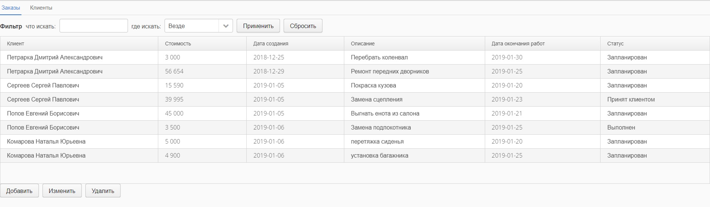

carservice
=========



Веб-приложение, эмулирующее систему ввода и отображения заказов автомастерской.

Технологии:
- Vaadin 7 в качестве графического интерфейса.
- HSQLDB в in-process режиме в качестве БД
- Доступ к БД через JDBC
- Maven в качестве системы сборки

Выполнено в качестве тестового задания в декабре 2018

Сборка и запуск
-------------

1. Набрать в командной строке:
	```
	mvn package
	mvn jetty:run
	```
2. Открыть `http://localhost:8080` в браузере.
